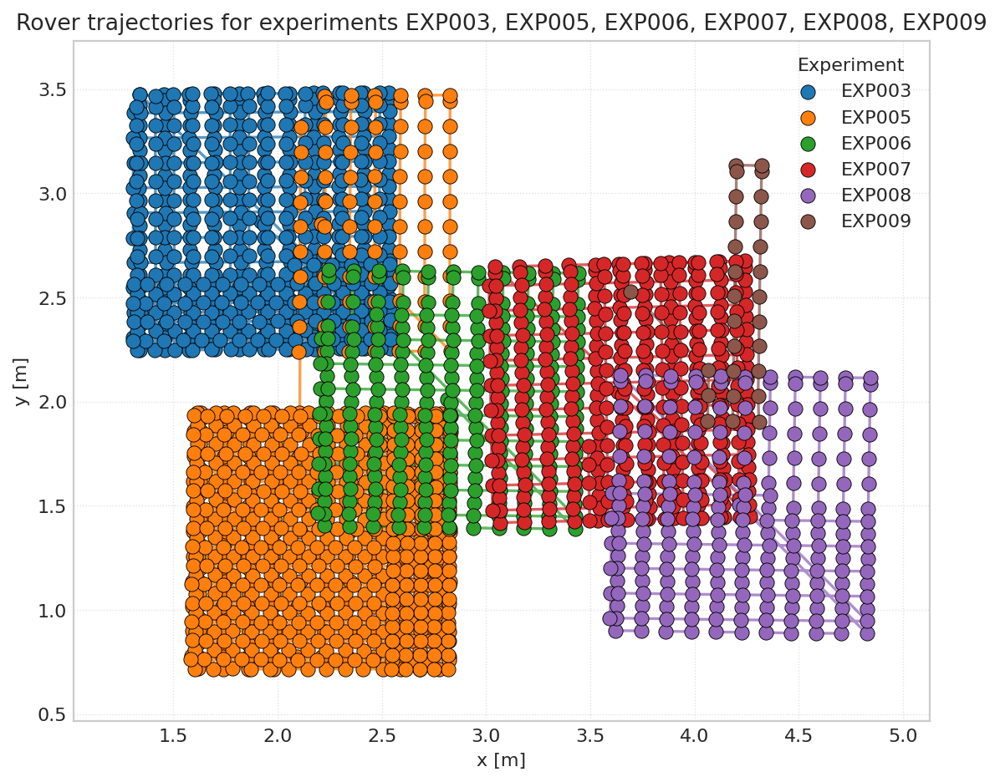

# ELLIIIT Dataset Repository

This repository contains the acquisition, orchestration, storage, and post-processing code used to collect the ELLIIIT acoustic and RF dataset inside Techtile.

<p align="center">
  
  
</p>

The user-facing documentation now lives in the GitHub Pages site under [`docs/`](docs/).

Primary entry points:

- Published docs: <https://techtile-by-dramco.github.io/ELLIIIT-dataset-26/>
- Local docs source: [`docs/`](docs/)
- Runnable notebook tutorials: [`processing/tutorials/plot_csi_positions.ipynb`](processing/tutorials/plot_csi_positions.ipynb), [`processing/tutorials/tutorial_xarray_structure.ipynb`](processing/tutorials/tutorial_xarray_structure.ipynb), [`processing/tutorials/tutorial_acoustic_xarray_structure.ipynb`](processing/tutorials/tutorial_acoustic_xarray_structure.ipynb), [`processing/tutorials/tutorial_rover_positions.ipynb`](processing/tutorials/tutorial_rover_positions.ipynb), [`processing/tutorials/tutorial_csi_per_position.ipynb`](processing/tutorials/tutorial_csi_per_position.ipynb), [`processing/tutorials/tutorial_rf_acoustic_position.ipynb`](processing/tutorials/tutorial_rf_acoustic_position.ipynb), [`processing/tutorials/tutorial_csi_movies.ipynb`](processing/tutorials/tutorial_csi_movies.ipynb)

Example notebook-generated figure:



This figure is generated from the rover-position tutorial notebook against the latest dataset in [`results/`](results/).

Local docs workflow:

```bash
cd docs
npm install
python -m pip install -r requirements.txt
npm run dev
```

To inspect or download the published acoustic `.nc` files into [`results/`](results/):

```bash
python processing/dataset-download/download_acoustic_datasets.py --list
python processing/dataset-download/download_acoustic_datasets.py --experiment-id EXP003
```

To refresh the exported notebook figures used in this README:

```bash
python docs/scripts/export_notebook_figures.py
```

To refresh the merged-dataset MP4s used in the docs:

```bash
python docs/scripts/export_notebook_movies.py
```

Key code paths remain in:

- `server/` for orchestration and control-plane logic
- `client/` for rover, RF, and auxiliary clients
- `acoustic/` for acoustic capture and processing
- `processing/dataset-download/` for published dataset download helpers
- `processing/parsing/` for RF and acoustic extraction/parsing scripts
- `processing/tutorials/` for xarray utilities and runnable notebook analysis
- `post-processing/` for user notebooks, scripts, figures, and follow-up analysis built on the dataset
